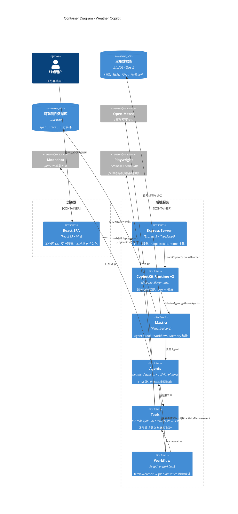

# 应用架构（Application Architecture）

> 4A 架构视角之一，对应 C4 模型的 **C2 Container**。
> 描述 Weather Copilot 内部的主要应用/容器、职责及相互关系。

## C2 Container Diagram



## 1. 容器清单

| 容器 | 技术 | 职责 | 关键源码 |
| --- | --- | --- | --- |
| React SPA | React 19 + Vite | 工作区 UI、会话管理、受控 CopilotChatView、localStorage 持久化 | `src/client/` |
| Express Server | Express 5 + tsx | HTTP 入口、JSON 解析、CopilotKit Runtime 挂载 | `src/index.ts` |
| CopilotKit Runtime v2 | `@copilotkit/runtime` | 将前端聊天请求路由到后端 Agent | `src/index.ts` |
| Mastra | `@mastra/core` | Agent、Tool、Workflow、Memory 的注册与编排 | `src/mastra/index.ts` |
| Agents | `@mastra/core/agent` | 三个 Agent 的指令、工具、记忆配置 | `src/mastra/agents/` |
| Tools | `@mastra/core/tools` | 外部 API 调用与网页抓取 | `src/mastra/tools/` |
| Workflow | `@mastra/core/workflows` | 天气获取 + 活动规划的两步工作流 | `src/mastra/workflows/` |

## 2. 数据存储容器

| 存储 | 技术 | 数据 | 说明 |
| --- | --- | --- | --- |
| 应用数据库 | LibSQL（本地 `mastra.db`，可选 Turso） | 线程、消息、记忆、资源身份 | `MastraCompositeStore` 的 default 域 |
| 可观测性数据库 | DuckDB（本地 `mastra.duckdb`） | span、trace、日志事件 | `MastraCompositeStore` 的 observability 域 |
| 浏览器本地存储 | localStorage | `WorkspaceState`、`mastra-resource-id` | 前端状态快照 |

## 3. 外部服务容器

| 外部服务 | 作用 | 集成方式 |
| --- | --- | --- |
| Moonshot | LLM 推理 | `@ai-sdk/openai-compatible` → `kimi.chatModel('kimi-k2.7-code')` |
| Open-Meteo | 地理编码与天气预报 | 裸 `fetch` + 指数退避 |
| Playwright | 无头浏览器渲染 | `playwright.chromium.launch` + 进程级复用 |

## 4. 容器间交互

### 4.1 前端 ↔ 后端

- 协议：CopilotKit v2 HTTP/JSON。
- 地址：开发时 Vite 代理 `/api` 到 Express `localhost:3000`。
- 关键头：`x-mastra-resource-id` 用于关联后端 Mastra Memory。

### 4.2 后端内部

```text
Express
  └── createCopilotExpressHandler
        └── CopilotRuntime
              └── MastraAgent.getLocalAgents({ mastra, resourceId })
                    ├── weatherAgent
                    │     ├── weatherTool
                    │     └── weatherWorkflow
                    │           ├── fetchWeather (Open-Meteo)
                    │           └── planActivities (activityPlannerAgent)
                    └── generalAgent
                          ├── webOpenUrl
                          └── webOpenUrlRendered (Playwright)
```

### 4.3 后端 ↔ 存储

- Mastra 通过 `MastraCompositeStore` 统一访问：
  - 应用数据 → LibSQLStore
  - 可观测性数据 → DuckDBStore

## 5. 部署视图

```text
┌─────────────────┐
│   浏览器用户     │
└────────┬────────┘
         │
         ▼
┌─────────────────┐     ┌─────────────────┐
│  React SPA      │────▶│  Vite dev server│ (dev only)
│  (dist/ 生产)    │     │  /api → proxy   │
└─────────────────┘     └────────┬────────┘
                                 │
                                 ▼
                        ┌─────────────────┐
                        │ Express Server  │
                        │ :3000           │
                        └────────┬────────┘
                                 │
            ┌────────────────────┼────────────────────┐
            ▼                    ▼                    ▼
    ┌───────────────┐   ┌───────────────┐   ┌───────────────┐
    │  mastra.db    │   │mastra.duckdb  │   │  Moonshot     │
    │  (LibSQL)     │   │  (DuckDB)     │   │  OpenAI 兼容  │
    └───────────────┘   └───────────────┘   └───────────────┘
            │
            ▼
    ┌───────────────┐
    │  Open-Meteo   │
    └───────────────┘
```

## 6. 模块边界与职责

| 边界 | 职责 | 不承担的职责 |
| --- | --- | --- |
| 前端 | 工作区管理、聊天视图、本地快照 | 不直接调用 LLM 或外部天气 API |
| Express 入口 | HTTP 服务、协议适配 | 不包含业务逻辑 |
| CopilotKit Runtime | Agent 发现与请求分发 | 不处理工具实现 |
| Mastra | 组件注册、存储与记忆抽象 | 不处理 UI 或协议细节 |
| Agents | 意图理解、工具选择、回复生成 | 不直接访问网络 |
| Tools | 外部数据获取、网页抓取 | 不做 LLM 推理 |
| Workflow | 多步骤天气+活动编排 | 不处理单步细节 |
