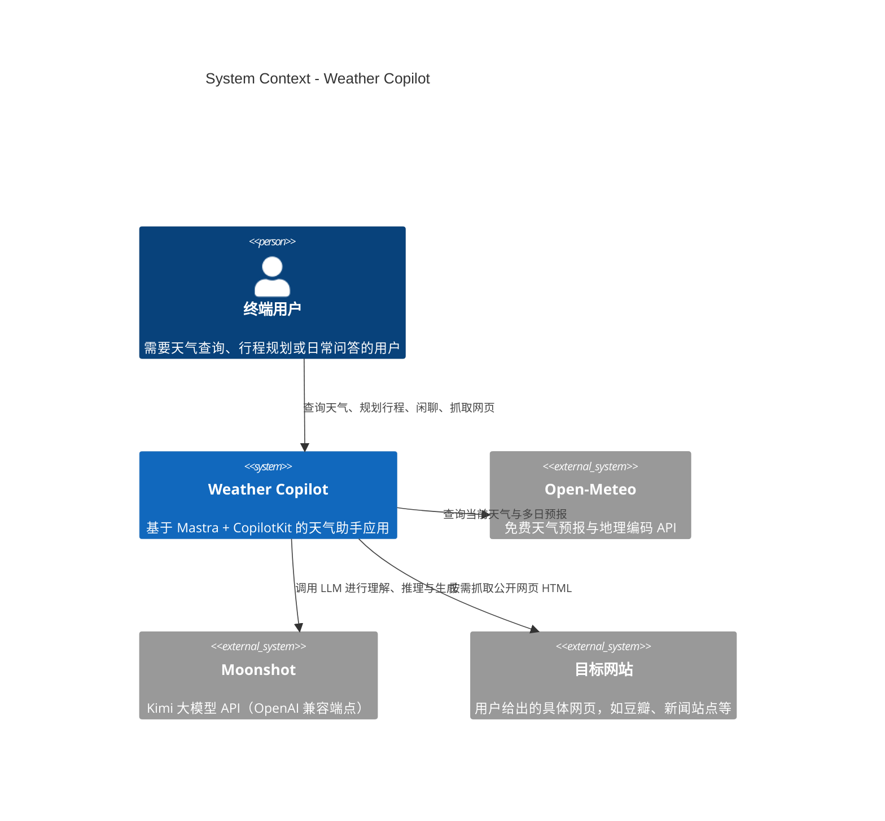

# 业务架构（Business Architecture）

> 4A 架构视角之一，对应 C4 模型的 **C1 System Context**。
> 描述 Weather Copilot 所处的业务环境、目标用户、核心场景及与外部系统的关系。

## C1 System Context

## 1. 业务目标

| 目标 | 说明 |
| --- | --- |
| 实时天气查询 | 用户询问指定城市当前天气，返回温度、湿度、风况、降水等信息 |
| 行程与活动规划 | 基于未来 1–7 天天气预报，推荐地点相关的每日活动安排 |
| 通用问答 | 支持日常闲聊、图片理解、写作、翻译等非天气类对话 |
| 网页内容辅助 | 用户给出具体网址时，抓取并围绕网页内容回答 |

## 2. 用户角色

| 角色 | 行为 |
| --- | --- |
| 终端用户 | 创建项目、创建会话、发送消息、上传图片、给出网址、查看历史 |

本系统为单用户本地/托管应用，不区分管理员、运营等角色。

## 3. 核心业务场景

### 3.1 当前天气查询

1. 用户在天气助手会话中输入城市名。
2. 后端 `weatherAgent` 识别为普通天气查询。
3. 调用 `weatherTool` → Open-Meteo 地理编码 + 当前天气。
4. 返回结构化的中文天气描述。

### 3.2 多日行程规划

1. 用户提出“帮我安排大连三天行程”。
2. `weatherAgent` 识别为活动/行程类请求，触发 `weatherWorkflow`。
3. 工作流第一步 `fetchWeather` 获取 3 天预报。
4. 第二步 `planActivities` 调用 `activityPlannerAgent` 按模板生成活动安排。
5. `weatherAgent` 原样保留活动正文并简短说明。

### 3.3 通用助手网页抓取

1. 用户在通用助手会话中发送网址。
2. `generalAgent` 调用 `webOpenUrl` 抓取原始 HTML。
3. 若失败原因为 JS 动态渲染或反爬，改用 `webOpenUrlRendered`（无头浏览器）。
4. 围绕返回内容回答，失败时如实说明。

### 3.4 工作区管理

1. 用户创建项目并选择助手类型（天气/通用）。
2. 在项目下创建多个会话。
3. 会话历史按今天/昨天/更早分组展示。
4. 删除项目时会话进入“未分类”，不被删除。

## 4. 外部系统

| 外部系统 | 类型 | 作用 | 失败策略 |
| --- | --- | --- | --- |
| Open-Meteo | 公共 API | 地理编码与天气预报 | 工具层指数退避重试，失败返回错误 |
| Moonshot | 大模型 API | LLM 推理与生成 | API key 缺失时无法运行；网络失败由 CopilotKit 前端提示 |
| 任意公开网页 | 第三方网站 | 用户指定 URL 的内容来源 | 403/超时/反爬/非 HTML 时返回结构化错误 |

## 5. 领域术语

详见 `CONTEXT.md`。本架构中高频术语：

| 术语 | 含义 |
| --- | --- |
| Workspace | 用户管理项目与会话的工作区域 |
| Project | 组织相关天气咨询/旅行规划的工作单元，绑定不可修改的助手类型 |
| Session | 用户与助手围绕连续任务的对话，保存消息快照 |
| Agent Type | `weather` 或 `general`，决定会话路由到哪个后端 Agent |
| Resource Identity | 后端关联 Mastra Memory 的独立用户身份 |

## 6. 业务约束

- 助手类型在项目创建时选定，不可修改。
- 通用助手没有主动搜索能力，只能打开用户给出的具体 URL。
- 天气助手遇到活动/行程/攻略类请求必须走工作流，不能只用 `weatherTool`。
- 图片 base64 不进入持久化，刷新后显示占位文案。
